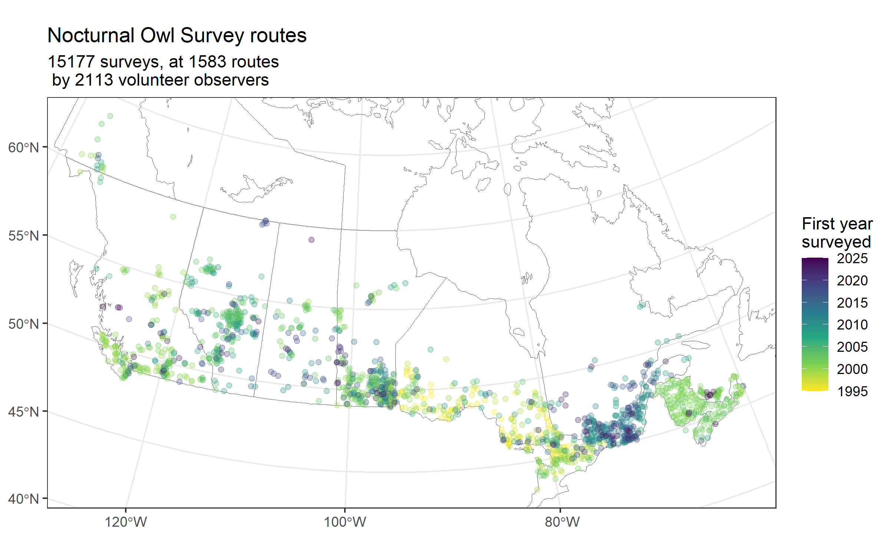
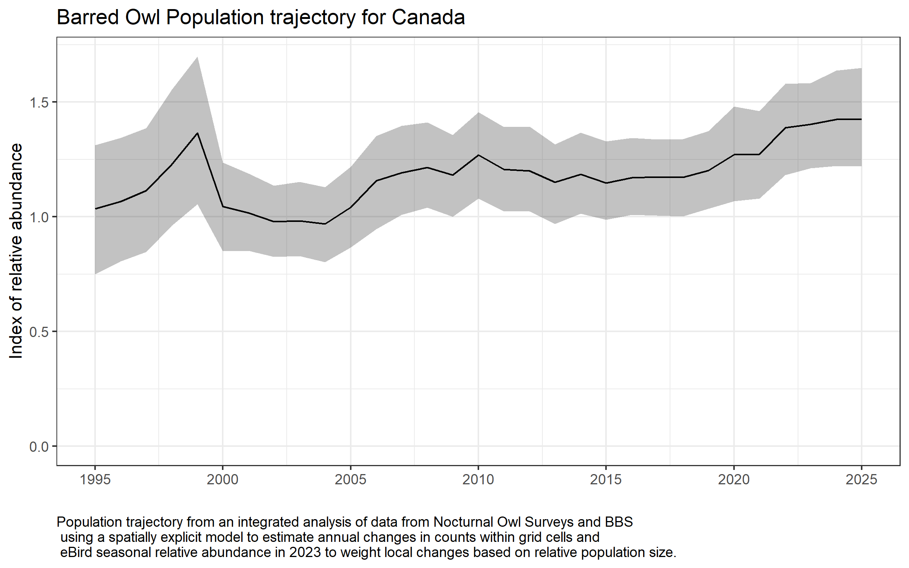
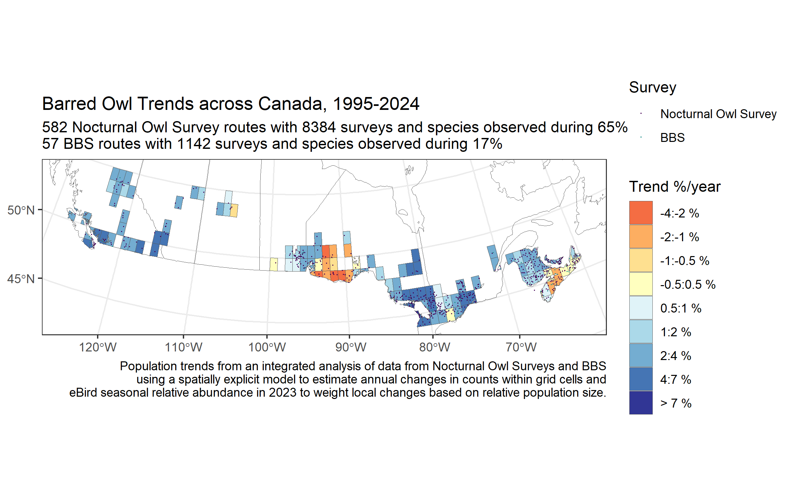
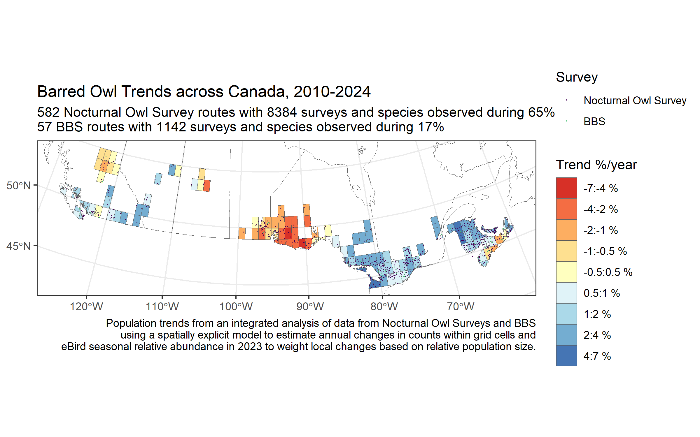
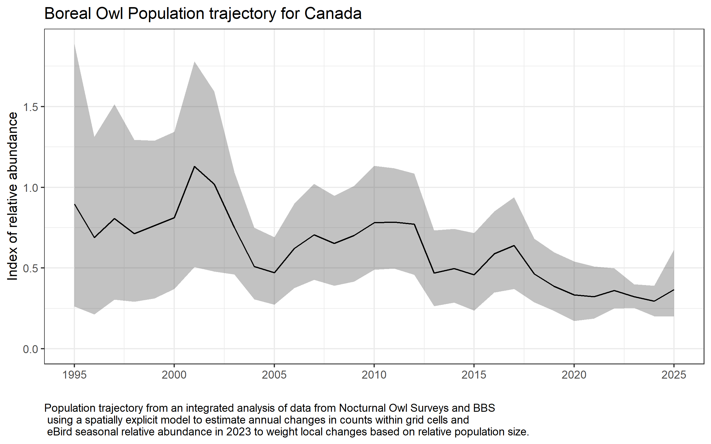
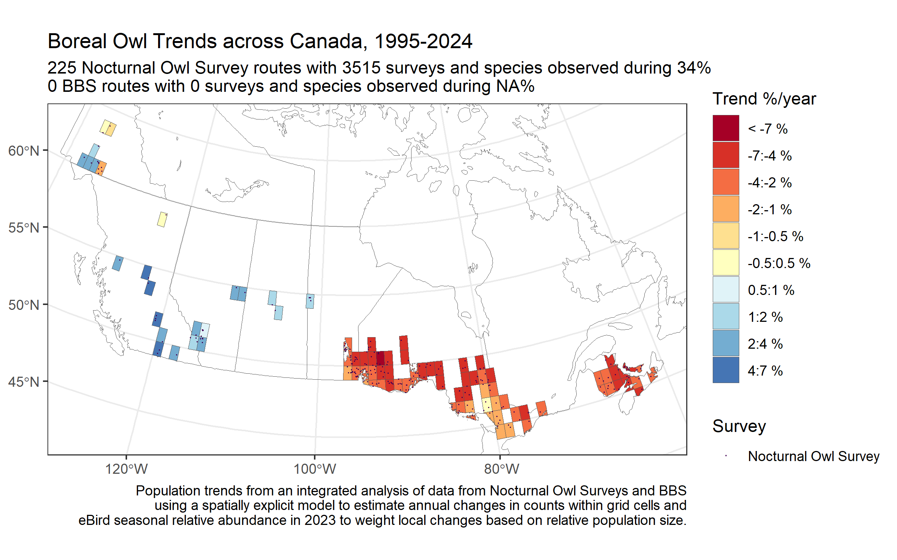

# Nocturnal Owl Surveys by Birds Canada, integrated across Canada, and with other long-term monitoring programs

## Under Active Development

Birds Canada's Nocturnal Owl Surveys provide structured annual monitoring of Owls across much of the population regions of Canada. The surveys follow roadside routes with between 10 and 30 stop locations separated by at least 1.6 km. At each stop, observers conduct a regionally optimized observation protocol that includes a call-playback period. Surveys are conducted after dark during the late-winter and early spring periods, at the peak of the nesting and territorial periods for owls in the region.

## Integrating across the country and among monitoring programs

Because the protocols are optimized to the regional species pool, they are not consistent across the country and this complicates comparisons of relative abundance among survey protocols. To integrate the trend information from each protocol across variations in each species' relative abundance, we have used the eBird weekly relative abundance surfaces, for the weeks of the year during which the monitoring surveys are conducted. In each spatial stratum (1-degree-longitude by 1-degree-latitude grid-cells), the model estimates a population trajectory (annual changes in relative abundance through time). The information on changes in annual relative abundance from the survey routes within that stratum provide estimates of the changes in relative abundance, relative to 2023 for all of the years of the monitoring program. The time-series component equals one in the year of the relative abundance prediction (2023 in the most recent version of the eBird status dataset). The full local population trajectories are the time-series component multiplied by mean expected count during a Nocturnal Owl survey with 10 stops, averaged across the variations in routes and survey protocols. So the trajectory values in all strata are equal in 2023, because each strata-level population trajectory represents the expected mean count during an average owl survey in that year based on the annual changes occurring in that stratum. 
To combine these strata-level trajectories across multiple strata (grid-cells), we weight each local trajectory based on the mean proportion of the species' relative abundance in each stratum. The population trajectory information from each stratum (1x1 degree grid cells) are summed across all of the strata with data to estimate a composite population trajectory for the monitored region of the country. For example, the Canada-wide trajectory is the weighted sum of all strata-level trajectories, where each stratum's trajectory is weighted by the estimated proportion of the eBird relative abundance values within the strata that included in the model (i.e., the proportion of the monitored population in that stratum).
Integrating the information on the eBird relative abundance surface would ideally account for the uncertainty of the estimated proportion of the population in each region. A full propagation of that uncertainty is very complicated; it would include the uncertainty in the predictions for each pixel of the eBird weekly relative abundance surface (e.g., the upper and lower 80% confidence limits available through the ebirdst package), the autocorrelation of that pixel-level uncertainty ([Wadoux and Heuvelink 2023](https://doi.org/10.1111/2041-210X.14106)), and the uncertainty of the mean relative abundance averaged across all weeks of the seasonal period used to weight the population trajectories. Here, we have only included the final component of uncertainty: the uncertainty of the seasonal mean relative abundance based on the variation of the relative abundance among weeks of the season. This component of uncertainty specifically captures the uncertainty in the assumption that the population and the spatial pattern in relative abundance estimates, are stationary during the survey season.  We propagate this component of uncertainty by applying the stratum weights for each random draw from the posterior distribution of trajectory estimates, we using a random draw of one of the weeks of the survey season. 

Using an independent dataset on relative abundance across the species' range also provides a way to integrate with other structured monitoring data. Just as it allows us to integrate information from among diverse field protocols for the owl surveys, so too we can integrate data from the North American Breeding Bird Survey into the model.

For Barred Owl, an example species with some data from both surveys, this integrated model estimates an overall increase in the species' population within the regions with monitoring data from one or both of these programs.

The stratum level information on annual changes in relative abundance are estimated using a spatially explicit, hierarchical Bayesian model that shares information among neighbouring strata. This spatial neighbourhood structure (an instrinsic Conditional Auto-Regressive model), allows the local estimates of population change to vary if the data support that variation, but also provides some spatial smoothing of the estimated trends.The long-term trends for Barred Owl suggest the species has increased across almost all of its range

More recently (since 2010) population trends vary more across the country.

### Boreal Owl

The Nocturnal Owl Survey data can also estimate population trends and trajectories for species with no other suitable source of standardized monitoring data. For example, Boreal Owl is considered data deficient in the most recent State of Canada's Birds, but the Nocturnal Owl Survey data show the species population has decreased, and that decrease is largely driven by declines in Eastern Canada.

