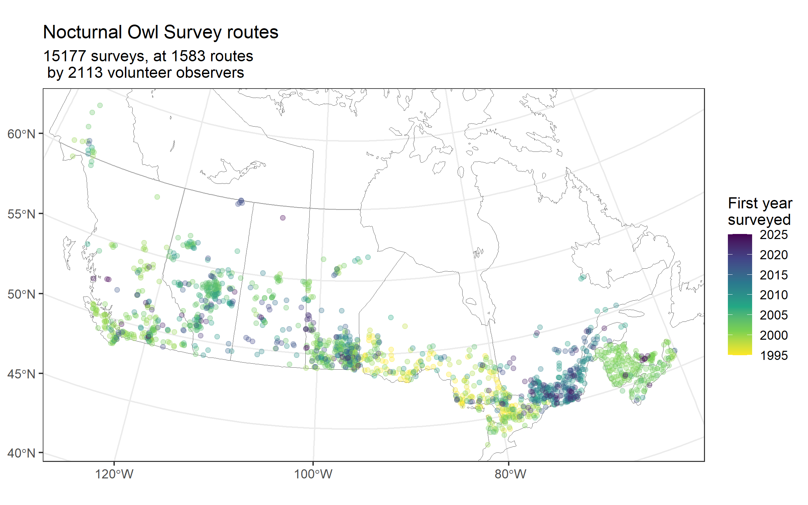
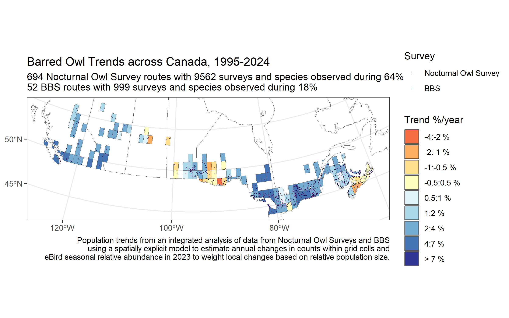
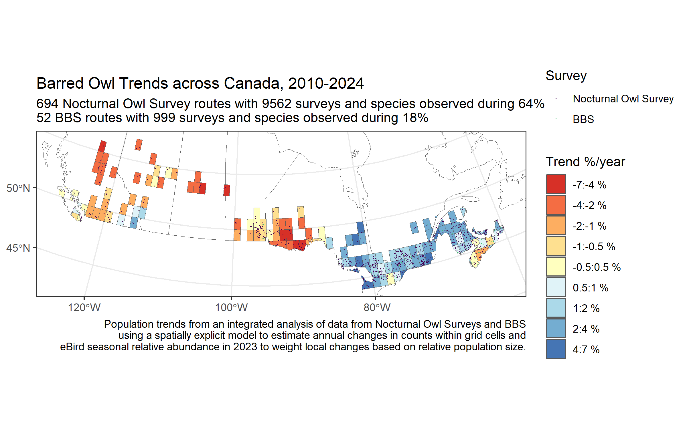
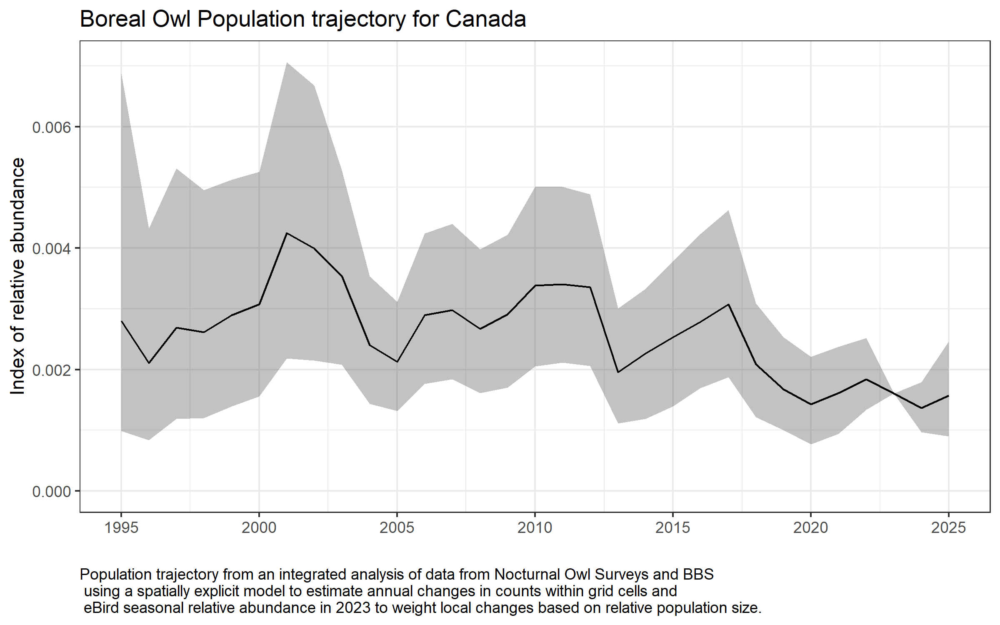
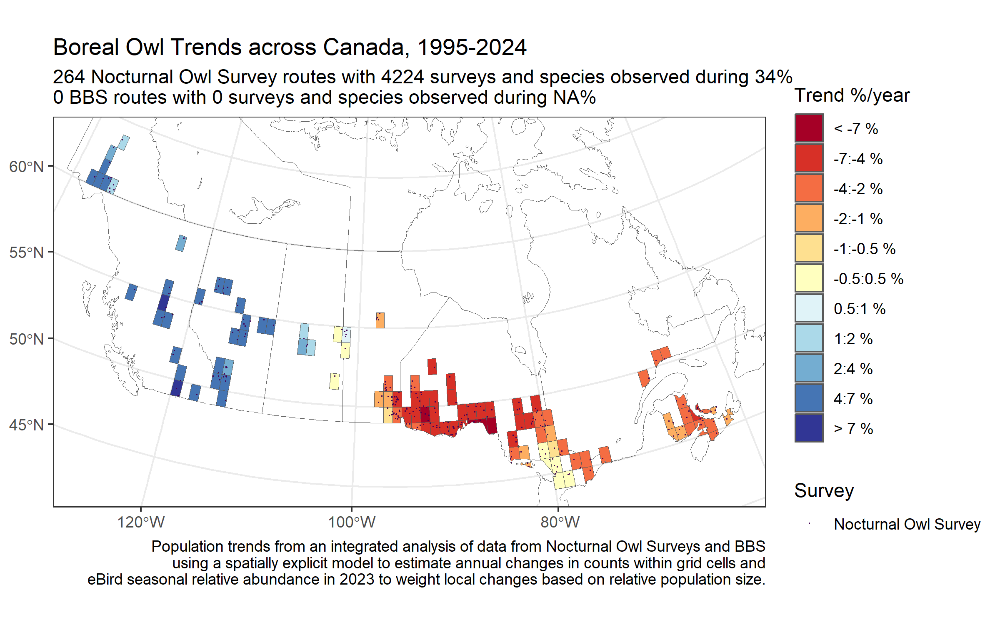

# Nocturnal Owl Surveys by Birds Canada, integrated across Canada, and with other long-term monitoring programs

## Under Active Development

Birds Canada's Nocturnal Owl Surveys provide structured annual monitoring of Owls across much of the population regions of Canada. The surveys follow roadside routes with between 10 and 30 stop locations separated by at least 1.6 km. At each stop, observers conduct a regionally optimized observation protocol that includes a call-playback period. Surveys are conducted after dark during the late-winter and early spring periods, at the peak of the nesting and territorial periods for owls in the region.

## Integrating across the country and among monitoring programs

Because the protocols are optimized to the regional species pool, they are not consistent across the country and this complicates comparisons of relative abundance among survey protocols. To integrate the trend information from each protocol across variations in each species' relative abundance, we have used the eBird seasonal relative abundance surface. In each spatial stratum (so far, 1-degree-longitude by 1-degree-latitude grid-cells), the model estimates a population trajectory (annual changes in relative abundance through time). These local population trajectories are centered on the average relative abundance of the species according to the eBird relative abundance surface in the year of the relative abundance prediction (2023 in the most recent version of the eBird status dataset). The information on changes in annual relative abundance from the survey routes within that stratum provide estimates of the changes in relative abundance, relative to 2023 for all of the years of the monitoring program.

Using an independent dataset on relative abundance across the species' range also provides a way to integrate with other structured monitoring data. So far, we have integrated data from the North American Breeding Bird Survey into the model.

The population trajectory information from each stratum (1x1 degree grid cells) are summed across all of the strata with data to estimate a composite population trajectory for the monitored region of the country.

For Barred Owl, an example species with some data from both surveys, this integrated model estimates an overall increase in the species' population within the regions with monitoring data from one or both of these programs.

The stratum level information on annual changes in relative abundance are estimated using a spatially explicit, hierarchical Bayesian model that shares information among neighbouring strata. This spatial neighbourhood structure (an instrinsic Conditional Auto-Regressive model), allows the local estimates of population change to vary if the data support that variation, but also provides some spatial smoothing of the estimated trends.The long-term trends for Barred Owl suggest the species has increased across almost all of its range

More recently (since 2010) population trends vary more across the country.

### Boreal Owl

The Nocturnal Owl Survey data can also estimate population trends and trajectories for species with no other suitable source of standardized monitoring data. For example, Boreal Owl is considered data deficient in the most recent State of Canada's Birds, but the Nocturnal Owl Survey data show the species population has decreased, and that decrease is largely driven by declines in Eastern Canada.

